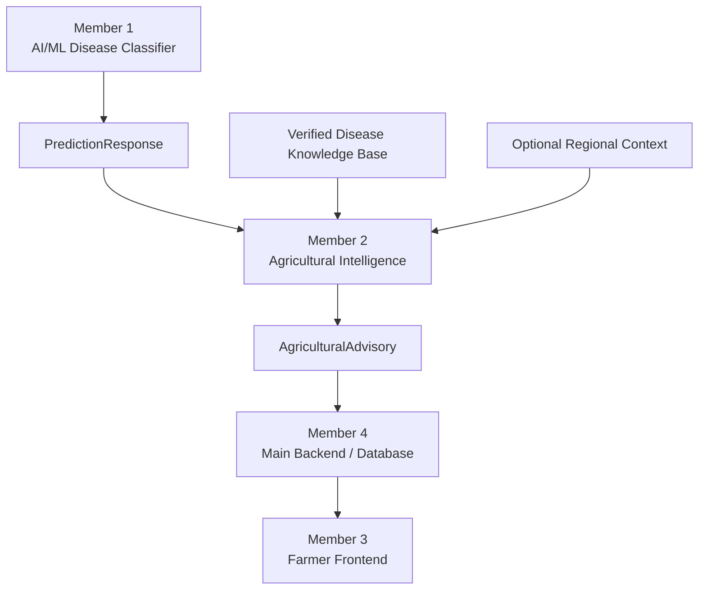

# 🌾 Agricultural Intelligence & Disease Advisory Module

<p align="center">
  <strong>Turning AI Crop Disease Predictions into Actionable Agricultural Guidance</strong>
</p>

<p align="center">
  <em>Hack2Ignite Hackathon · Agriculture Track AG-01</em>
</p>

<p align="center">
  <strong>Team Malicious</strong>
</p>
<div align="center">
<p align="center">


</p>
</div>

## 🚜 Overview

AI-based crop disease detection is only the first step.

A farmer also needs to understand:

* What disease has been detected?
* What symptoms should be expected?
* How serious is the condition?
* What are the possible causes?
* What management practices can be followed?
* How can the disease be prevented?
* When should expert guidance be considered?

The **Agricultural Intelligence & Disease Advisory Module** bridges the gap between **AI prediction and practical agricultural decision support**.

It transforms Member 1's canonical `PredictionResponse` into a structured, farmer-friendly `AgriculturalAdvisory` containing verified disease information, severity, management guidance, preventive measures, and optional regional context.

> **AI detects. Agricultural Intelligence explains. Farmers act.**

---

## 🎯 Project Purpose

This module serves as the intelligent advisory layer between the AI/ML disease classifier and the rest of the agricultural platform.

It does **not** train, retrain, or override the AI model.

Instead, it interprets the model's canonical output and enriches it using a verified agricultural knowledge repository.

### Core Objective

Transform:

```text
Raw AI Disease Prediction
```

into:

```text
Reliable, Structured, Actionable Agricultural Advisory
```

### Position in the System

```text
Member 1 — AI/ML Disease Classifier
                    ↓
             PredictionResponse
                    ↓
Member 2 — Agricultural Intelligence
                    ↓
             AgriculturalAdvisory
                    ↓
Member 4 — Main Backend / Database
                    ↓
Member 3 — Farmer Frontend
```

---

## ✨ Key Features

### 🧠 AI Prediction Interpretation

Converts raw disease predictions into meaningful agricultural guidance while preserving the original AI output.

### 📚 Verified Agricultural Knowledge

Provides disease descriptions, symptoms, possible causes, severity, management practices, preventive measures, and source metadata.

### ⚖️ Independent Severity Evaluation

Disease severity is handled independently from model confidence.

> **Confidence indicates model certainty. Severity indicates disease impact.**

### 🛡️ Safety-First Advisory Generation

Prevents fabricated disease information, unsupported recommendations, and unsafe chemical instructions.

### 📍 Optional Regional Context

Supports regional agricultural insights when real, documented data is available.

### 🔍 Strict Disease Matching

Uses exact-normalized lookup rather than fuzzy matching to prevent incorrect disease assumptions.

### 🚦 Confidence-Aware Status

Low-confidence predictions can be marked as requiring review instead of being treated as certain.

### 🔗 Integration-Ready Design

Provides a clean contract for integration with the AI model, backend, database, and frontend.

---

## 🏗️ System Architecture



### Data Flow

```text
LIVE AI PREDICTION
       ↓
STRICT VALIDATION
       ↓
DISEASE KNOWLEDGE LOOKUP
       ↓
SEVERITY + GUIDANCE
       ↓
CONFIDENCE EVALUATION
       ↓
REGIONAL CONTEXT (IF AVAILABLE)
       ↓
AGRICULTURAL ADVISORY
       ↓
BACKEND + FARMER INTERFACE
```

---

## 🔄 Advisory Processing Pipeline

```text
1. Receive PredictionResponse
             ↓
2. Validate prediction schema
             ↓
3. Preserve original AI fields
             ↓
4. Evaluate prediction status
             ↓
5. Lookup verified disease knowledge
             ↓
6. Check confidence threshold
             ↓
7. Attach severity and guidance
             ↓
8. Add regional context if available
             ↓
9. Generate AgriculturalAdvisory
             ↓
10. Return structured API response
```

---

## 🧩 Project Structure

```text
agricultural-intelligence/
│
├── app/
│   ├── main.py
│   │   └── FastAPI app + global error handling
│   │
│   ├── api/
│   │   └── advisory.py
│   │       └── HTTP endpoints
│   │
│   ├── core/
│   │   ├── config.py
│   │   │   └── Application settings
│   │   └── errors.py
│   │       └── Canonical error codes
│   │
│   ├── schemas/
│   │   ├── prediction.py
│   │   │   └── Member 1 prediction contract
│   │   ├── location.py
│   │   │   └── Location and regional insight schemas
│   │   └── advisory.py
│   │       └── Agricultural advisory response models
│   │
│   ├── services/
│   │   ├── advisory_service.py
│   │   │   └── Core advisory engine
│   │   ├── disease_lookup_service.py
│   │   │   └── Knowledge lookup logic
│   │   └── regional_insight_service.py
│   │       └── Regional context handling
│   │
│   ├── repositories/
│   │   └── disease_repository.py
│   │       └── Swappable knowledge repository
│   │
│   └── utils/
│       └── normalization.py
│           └── Exact-normalized key matching
│
├── data/
│   └── disease_knowledge.json
│
├── tests/
│   └── 70 automated tests
│
├── requirements.txt
├── .env.example
└── AGRICULTURAL_INTEGRATION_CONTRACT.md
```

---

## 📊 Advisory Decision Logic

| AI Prediction Status | Module Behaviour                                 |
| -------------------- | ------------------------------------------------ |
| `diseased`           | Generates disease-specific agricultural guidance |
| `healthy`            | Provides preventive and monitoring guidance      |
| `unknown`            | Marks advisory as `requires_review`              |
| Unsupported disease  | Returns `not_available`                          |
| Low confidence       | Flags advisory for review                        |
| Missing knowledge    | Does not fabricate information                   |

### Advisory Statuses

```text
ready
requires_review
not_available
```

---

## 🧠 Engineering Principles

This module is designed around **trust, correctness, and responsible AI interpretation**.

### 1. AI Output Integrity

The module never modifies the following fields received from Member 1:

```text
scan_id
crop
disease
status
confidence
```

The original prediction remains authoritative.

### 2. Confidence ≠ Severity

A model can be highly confident about a disease that has low severity, or uncertain about a disease that may be highly severe.

These concepts are intentionally independent.

### 3. No Fabricated Information

If disease knowledge is unavailable, the module returns an explicit unavailable state instead of guessing.

### 4. No Fuzzy Disease Guessing

Near-match disease names are not silently mapped to known diseases.

### 5. Location Does Not Override AI

Location can provide additional context but cannot change the AI-identified disease.

### 6. Strict Schema Validation

Invalid confidence values, statuses, enums, and malformed requests are rejected explicitly.

### 7. Swappable Repository Layer

The knowledge repository can later be replaced with a database-backed implementation without changing the advisory engine.

---

## 📚 Knowledge Base

The current hackathon knowledge base contains a small, verified illustrative dataset.

### Supported Crops

* 🍅 Tomato
* 🥔 Potato
* 🌽 Maize

### Supported Diseases

* Tomato Early Blight
* Tomato Late Blight
* Potato Late Blight
* Maize Common Rust

### Knowledge Record Schema

Each record contains:

```text
Crop
Disease
Description
Symptoms
Possible Causes
Severity
Management Practices
Preventive Measures
Source
Source URL
Last Verified
```

### Data Source Strategy

Disease information is backed by documented agricultural sources.

The current dataset is intentionally limited and should be expanded with additional verified agricultural extension, ICAR, USDA, or equivalent sources before production deployment.

---

## 🔌 API Endpoints

| Method | Endpoint                            | Purpose                        |
| ------ | ----------------------------------- | ------------------------------ |
| GET    | `/api/v1/health`                    | Service liveness check         |
| POST   | `/api/v1/advisory`                  | Generate agricultural advisory |
| GET    | `/api/v1/diseases/{crop}/{disease}` | Retrieve disease knowledge     |

### Interactive API Documentation

Once the server is running:

```text
http://localhost:8000/docs
```

Swagger UI provides interactive API testing.

---

## ⚙️ Installation & Setup

### Requirements

* Python 3.11+
* pip
* Virtual environment recommended

### Navigate to the Module

```bash
cd agricultural-intelligence
```

### Create Virtual Environment

```bash
python3 -m venv .venv
```

### Activate Environment

#### Linux / macOS

```bash
source .venv/bin/activate
```

#### Windows

```bash
.venv\Scripts\activate
```

### Install Dependencies

```bash
pip install -r requirements.txt
```

### Configure Environment

```bash
cp .env.example .env
```

Default configuration works out of the box.

### Start the Server

```bash
uvicorn app.main:app --reload --port 8000
```

---

## 🧪 Testing

The module includes **70 automated tests** covering validation, advisory generation, API behaviour, and integration.

```bash
pytest
```

### Test Coverage

| Test Suite            |  Tests | Focus                            |
| --------------------- | -----: | -------------------------------- |
| Prediction validation |     13 | Schema and confidence validation |
| Severity handling     |      6 | Severity enums and defaults      |
| Disease lookup        |      8 | Exact matching and normalization |
| Regional insights     |      5 | Regional context behaviour       |
| Location validation   |      7 | Location schema validation       |
| Advisory generation   |     16 | All advisory paths               |
| API endpoints         |     13 | Endpoints and error handling     |
| Member 1 integration  |      2 | Canonical end-to-end payload     |
| **Total**             | **70** |                                  |

### Validation Includes

* Confidence bounds
* Invalid status rejection
* Missing required fields
* Percentage-shaped confidence rejection
* No confidence rescaling
* Exact disease matching
* No fuzzy lookup
* AI field preservation
* Severity independence
* Regional insight handling
* Canonical API error codes
* End-to-end integration testing

---

## 🛡️ Safety & Reliability

Agricultural advice can directly influence crop management decisions.

This module therefore follows strict safety principles:

* No fabricated disease information
* No fabricated regional statistics
* No pesticide dosages
* No chemical treatment schedules
* General management guidance only
* Expert consultation for uncertain or serious cases
* Explicit unsupported-disease handling
* Privacy-conscious location processing

### AI Uncertainty Disclaimer

Every advisory communicates that the result is AI-generated general guidance and recommends consulting a qualified agricultural expert for serious or uncertain cases.

---

## 🔗 Integration Contract

The module is designed to integrate seamlessly with the other components of the platform.

### Member 1 → Member 2

Member 1 provides the canonical:

```text
PredictionResponse
```

The module validates field names, types, confidence values, and enum values against the locked contract.

### Member 2 → Member 3

The frontend receives:

```text
AgriculturalAdvisory
```

and can render the response directly without understanding internal lookup or regional logic.

### Member 2 → Member 4

The backend can persist the advisory or selected fields alongside the scan record.

### Database Extensibility

The `DiseaseKnowledgeRepository` abstraction allows future migration to:

* PostgreSQL
* Supabase
* Other database systems

without changing the core advisory logic.

---

## 🌍 Future Expansion

The architecture supports future enhancements such as:

* Expanded crop and disease coverage
* Additional verified agricultural knowledge sources
* ICAR and agricultural extension integration
* Regional disease trend analysis
* Weather-aware advisory generation
* Multilingual farmer guidance
* Voice-based agricultural assistance
* Regional crop alerts
* Database-backed knowledge repositories
* Advanced preventive recommendation systems

> These are planned extension opportunities and are not claimed as currently implemented functionality.

---

## 👨‍🌾 Real-World Impact

The goal of this module is not simply to return a disease label.

It is to make AI predictions:

**Understandable. Responsible. Actionable.**

```text
AI Detection
     ↓
Verified Agricultural Knowledge
     ↓
Contextual Interpretation
     ↓
Actionable Guidance
     ↓
Better-Informed Farming Decisions
```

By combining machine learning with structured agricultural knowledge, this module helps transform a technical prediction into a practical decision-support layer for farmers.

---

## 🏆 Hackathon Context

Developed for:

### Hack2Ignite Hackathon

**Track:** Agriculture
**Track Code:** AG-01
**Team:** Malicious

The module contributes the agricultural intelligence and advisory layer of the overall platform.

---

## 👥 Team Malicious

Built collaboratively by **Team Malicious** as part of the Hack2Ignite Hackathon.

---

## 📄 License

Developed for educational, research, and hackathon purposes.

---

<p align="center">
  <strong>🌱 Intelligence for Crops. Clarity for Farmers.</strong>
</p>

<p align="center">
  <em>Built by Team Malicious for Hack2Ignite.</em>
</p>
